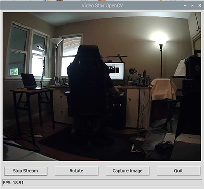

# Video Streamer in Python

Stream a video camera source to a Python Tkinter program using OpenCV.

## Purpose

This cross platform program can be used to stream a video source to a Python Tkinter program. I use it in my Raspberry Pi projects to see where the robot is going. I run the program on the desktop of the Pi through a RealVNC session.

NOTE: With Bullseye, you have to switch to Picamera2 to take or stream images. OpenCV can still be used to manipulate images.

From the Raspblock.

## Version History

- (08/01/24) video_pi.py uses Picamera2 library from Bullseye and newer
- (06/18/24) Add self.root.protocol("WM_DELETE_WINDOW", quit) to close cv2 camera, exit without exception
- (06/27/23) V3 Redesign GUI
- (08/01/23) V1 Basic functionality

## License

 This work is licensed under a <a rel="license" href="http://creativecommons.org/licenses/by-nc-sa/4.0/">Creative Commons Attribution-NonCommercial-ShareAlike 4.0 International License</a>.

Copyright (c) 2024 William A Loring
